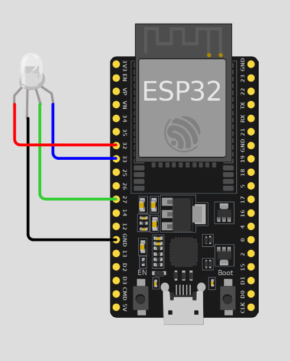

Приёмник и передатчик для устройства сообщающее об ошибках.

Использованные компоненты:
Для приёмника: ardoino uno, tcs34725.
Для передатчика: esp32, rgb led.

В DesktopClient ПК приложение для декодирования данных приёмника. 

Схема подключения приёмника:

Схема подключения передатчика:

